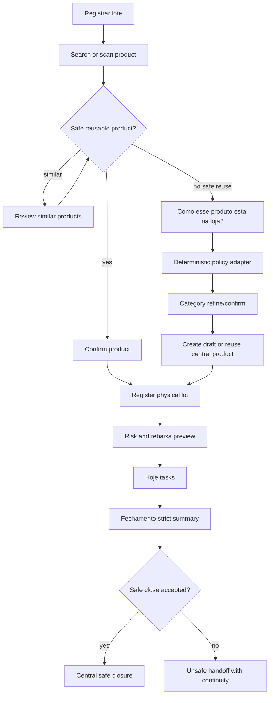

# Phase 15: Operational Surface Distillation - Research

**Researched:** 2026-06-30
**Domain:** Mobile-first operational UX, deterministic product policy, readiness distillation
**Confidence:** HIGH

<user_constraints>
## User Constraints

### Locked Decisions

- **D-01:** `Registrar lote` opens a focused product search/scan surface. The first surface should not show an equal-weight `Cadastrar produto novo`, unfiltered category browsing, or diagnostic shortcuts that compete with the lot task.
- **D-02:** Product creation appears only after the search/scan result reaches a no-safe-reuse state. If a reusable product is found, the next step is direct lot registration. If similar products exist, the operator must review them before creating a new draft.
- **D-03:** Recent/frequent/category shortcuts may remain only as secondary lookup aids if they do not compete with the primary search/scan path. Category browsing must not be the first way to decide product policy in this phase.
- **D-04:** Product creation or review starts with the operator-readable question: `Como esse produto esta na loja?` This question must render before any category rows or unfiltered category list.
- **D-05:** The classifier choices are the SPEC choices: `Inteiro solto`, `Embalado pelo fornecedor`, `Cortado/PED`, `Fracionado ou reembalado na loja`, `Preparado pronto`, `Ovos`, `Industrial/refrigerado com validade`, and `Outro/nao sei`.
- **D-06:** The classifier maps to a bounded validity/rebaixa policy first, then category selection refines or confirms that policy. The operator should never need to choose or understand technical `ProductMode` labels.
- **D-07:** Use a deterministic policy layer that maps classifier/category/product override to mode, required lot dates, rebaixa permission, default rebaixa window, quality window, and terminal action semantics. The UI shows human language, not `formal_validity`, `flv_inspection`, `processed_repack_loss`, or `receiving_monitored`.
- **D-08:** Rebaixa is a commercial task before expiry. It is allowed only when the lot has formal/printed expiry, category/product policy allows rebaixa, the current date is inside the configured window, and the lot is not expired.
- **D-09:** PED/cut, fractioned/repacked, prepared products, and `Outro/nao sei` do not enter rebaixa by default. `Outro/nao sei` may allow lot capture, but stays conservative and pending review instead of silently allowing rebaixa.
- **D-10:** Lot form preview copy uses operational next-action terms: `fica no radar`, `pedir rebaixa`, `retirar/perda`, `reembalar/perda`, and `conferir qualidade`. Existing products/lots keep their current mode/profile and are interpreted compatibly; missing policy details fall back conservatively.
- **D-11:** A central read with zero products, zero lots, zero active tasks, and no auth/sync blocker is an expected first-store state, not a fatal prepare-turn error.
- **D-12:** The empty-store state should say, in plain operational language, that the store is ready to register its first lot. The primary action is `Registrar lote`, which opens the same focused search/scan path and then product creation only if missing.
- **D-13:** Empty store guidance must not claim that the sales area is proven safe. It is a first-action path for real operation, while safe close still depends on central revalidation, task state, sync state, and the physical checklist.
- **D-14:** Ajustes owns detailed healthy diagnostics for push, sync, build/update, account/store, privacy, and sign-out. Hoje should not render full-width blocking cards for healthy sync/push/build/camera states.
- **D-15:** Hoje promotes readiness to explicit blocker cards only when the state affects task execution, safe close, or validation. Examples: stale or missing central read, critical sync conflict, critical local command pending central confirmation, required/incompatible update, invalid authorization/device, or push/camera required for the current validation proof.
- **D-16:** Fechamento do turno should summarize active tasks, unresolved sync, stale central read, device/build blockers, and the physical checklist before enabling safe close. Its strict blocker semantics should remain stronger than ordinary Hoje status copy.
- **D-17:** Web changes are limited to vocabulary/review clarity needed by Phase 15. Command Center, Operacao, Aparelhos, Hoje, Fechamento, and Ajustes should share public labels for central read, local queue/cache, push, camera, build, device authorization, product review, and lot sync.

### the agent's Discretion

- Exact TypeScript identifier names for the policy helpers and test fixtures.
- Whether the shared vocabulary is one helper file or a small set of copy constants, as long as labels stay public-safe and imported where needed.
- Exact visual arrangement inside existing mobile/web primitives, as long as the task-first hierarchy and 48 dp touch targets remain intact.

### Deferred Ideas (OUT OF SCOPE)

- New database schema, product master-data workflow, or microservice boundary.
- Real network/provider push proof, installed Android/camera proof, or physical Loja 18 UAT claim.
- Rebuilding the Command Center architecture beyond vocabulary and review clarity.
</user_constraints>

<architectural_responsibility_map>
## Architectural Responsibility Map

| Capability | Primary Tier | Secondary Tier | Rationale |
|------------|--------------|----------------|-----------|
| Lot-first product lookup | Mobile client | Contracts/API | The operator starts in mobile; contracts/API only validate safe reuse and drafts. |
| Store-presentation classifier | Domain/contracts | Mobile client | The mapping must be deterministic and testable; mobile renders human choices. |
| Lot risk/rebaixa preview | Domain | Mobile client | Existing `calculateLotRisk` and task projection own risk; mobile translates it to operator copy. |
| Empty-store prepare-turn path | Mobile client | API contracts | Current prepare-turn response already carries counts/source; mobile owns the first-lot journey. |
| Hoje readiness distillation | Mobile client | Domain/contracts | Hoje decides prominence; existing sync/push/readiness helpers provide facts. |
| Safe-close blocker summary | Domain/mobile client | API contracts | Domain keeps strict blocker semantics; mobile summarizes before safe close. |
| Command Center vocabulary alignment | Web client | Contracts/API | Web projection already exists; Phase 15 adjusts labels and grouping only. |
</architectural_responsibility_map>

<research_summary>
## Summary

Phase 15 is not a new infrastructure phase. It is an operational distillation phase across surfaces that already exist: product discovery, product draft creation, lot registration, Hoje, Preparar turno, Fechamento do turno, Ajustes, and the web Command Center. The safest implementation path is to preserve the existing monorepo stack and introduce one deterministic product-policy layer that translates an operator-readable classifier into the existing `ProductMode`, date requirements, rebaixa permission, and terminal action semantics.

The standard approach for this product is "policy in domain/contracts, task hierarchy in mobile, vocabulary consistency in shared copy/tests." Product UI must remain restrained: no new component vocabulary, no decorative motion, no technical labels exposed to operators, and no healthy diagnostic cards competing with actual sales-area work. Empty store is a first-lot onboarding state, not proof of a safe sales area.

**Primary recommendation:** Implement a deterministic classifier-to-policy adapter first, then update the mobile flows and web labels around that source of truth while preserving existing data compatibility and strict safe-close semantics.
</research_summary>

<standard_stack>
## Standard Stack

### Core

| Library | Version | Purpose | Why Standard |
|---------|---------|---------|--------------|
| TypeScript | 6.0.3 | End-to-end typing | Existing strict monorepo contract and no justified `any`. |
| Zod | Existing workspace dependency | Runtime boundary validation | Existing contracts package uses Zod schemas for mobile/API data shapes. |
| React Native / Expo | React 19.2.7, Expo 56 | Mobile operational app | Existing capture screens, camera/push/offline stack, mobile-first UX. |
| Vitest | 4.1.9 | Domain, contract, mobile, web tests | Existing test runner across all packages. |
| React/Vite | React 19.2.7, Vite 8 | Web Command Center | Existing internal admin surface and tests. |

### Supporting

| Library | Version | Purpose | When to Use |
|---------|---------|---------|-------------|
| lucide-react | 1.21.0 | Web icons | Existing web route buttons and status surfaces. |
| react-test-renderer | 19.2.7 | Mobile component tests | Existing mobile tests mock React Native primitives. |
| Playwright | 1.61.0 | Web E2E | Only for final web readiness smoke if UI behavior changes materially. |

### Alternatives Considered

| Instead of | Could Use | Tradeoff |
|------------|-----------|----------|
| Existing `ProductMode` + policy adapter | New persisted ProductMode taxonomy | More churn, possible migrations, and higher compatibility risk. |
| Existing `StatusNotice`, `PrimaryAction`, `SelectionRow` | New visual component set | Inconsistent product UI vocabulary and extra a11y burden. |
| Existing `evaluateShiftClose` strict domain gate | UI-only close blockers | UI-only gates can diverge from safe-close truth. |

**Installation:** No new packages are recommended.
</standard_stack>

<architecture_patterns>
## Architecture Patterns

### System Architecture Diagram



### Recommended Project Structure

```text
packages/contracts/src/capture.ts        # Classifier schema and request/record validation
packages/domain/src/product-policy.ts    # Classifier/category/override policy resolution
apps/mobile/src/capture/capture-copy.ts  # Human labels and public vocabulary
apps/mobile/src/capture/*Screen.tsx      # Existing mobile surfaces, no new UI framework
apps/web/src/command-center/*            # Web vocabulary/review clarity only
```

### Pattern 1: Deterministic Policy Adapter

**What:** A small pure function maps `StorePresentationKind + categoryRuleProfile + optional productRuleOverride` to existing mode/date/rebaixa/terminal-action behavior.
**When to use:** Product creation, product confirmation, lot form field selection, preview copy, and compatibility fallback.
**Example:** `supplier_packaged` resolves to formal printed validity with rebaixa allowed; `store_cut_ped` resolves to processed/repack-loss with rebaixa disabled.

### Pattern 2: Product UI Serves the Task

**What:** Keep existing mobile primitives, fixed type sizes, restrained color, and large touch targets. The first screen answers "what do I do now?" before it offers secondary lookup or diagnostics.
**When to use:** Product discovery, classifier, empty-store guidance, Hoje readiness, and shift close.
**Example:** `Cadastrar produto novo` is hidden until lookup says no safe reuse; `Recentes`, `Frequentes`, and `Por categoria` stay secondary.

### Pattern 3: Readiness Ownership Split

**What:** Ajustes owns healthy diagnostics and detail; Hoje promotes only blockers that affect execution/safe close/validation; Fechamento is stricter than Hoje.
**When to use:** Sync, push, camera, build/update, device authorization, central read, local queue/cache, and validation proof.
**Example:** "Tudo sincronizado neste aparelho" is not a full-width Hoje blocker; "Conflito critico de sincronizacao" is.

### Anti-Patterns to Avoid

- **Exposing `ProductMode` labels:** Operators should see "Embalado pelo fornecedor" and "Pedir rebaixa", not `formal_validity`.
- **Treating empty store as safe:** Zero products/lots/tasks is a first-lot path only; safe close still needs central revalidation, task state, sync state, and checklist.
- **Duplicating readiness rules per screen:** Use helpers and tests so Hoje, Ajustes, Fechamento, and web vocabulary do not drift.
- **Adding persistence without need:** The classifier can map into existing product rule/profile fields and optional review metadata without forcing a migration.
</architecture_patterns>

<dont_hand_roll>
## Don't Hand-Roll

| Problem | Don't Build | Use Instead | Why |
|---------|-------------|-------------|-----|
| Risk state calculation | UI-side date math | `calculateLotRisk` and domain task helpers | Existing tests cover windows and task projection. |
| Safe-close eligibility | Screen-local blocker logic | `evaluateShiftClose` | The domain already encodes strict close semantics. |
| Search similarity | Mobile string heuristics | Existing central/local repository search and draft outcomes | Search outcome drives safe reuse and review. |
| UI component system | New buttons/cards/forms | `capture-ui`, `capture-theme`, shadcn web components | Existing accessibility and visual vocabulary stay intact. |
| Readiness labels | One-off copy in every screen | Shared copy/helper constants | Prevents Hoje/Ajustes/web vocabulary drift. |

**Key insight:** The hard part is not a new algorithm; it is preventing operational ambiguity from reappearing in multiple screens.
</dont_hand_roll>

<common_pitfalls>
## Common Pitfalls

### Pitfall 1: Category Becomes Policy Again

**What goes wrong:** Product creation starts with unfiltered categories and reintroduces technical mode choice.
**Why it happens:** Existing `ProductFormScreen` loads categories immediately.
**How to avoid:** Render `Como esse produto esta na loja?` first; categories refine after classifier selection.
**Warning signs:** Tests find category rows before the classifier question.

### Pitfall 2: Healthy Diagnostics Crowd Hoje

**What goes wrong:** Normal sync/push/build/camera state takes as much visual weight as active risks.
**Why it happens:** Status components are reused without a prominence policy.
**How to avoid:** Add a Today readiness filter that promotes only execution/safe-close/validation blockers.
**Warning signs:** Healthy fixtures render full-width warning/error cards in the default Hoje scan.

### Pitfall 3: Rebaixa Becomes a Generic Discount Button

**What goes wrong:** PED, prepared, unknown, or expired lots can enter rebaixa automatically.
**Why it happens:** UI reads only `markdown_due` without checking formal printed validity and policy permission.
**How to avoid:** Gate rebaixa through the product-policy adapter and risk state.
**Warning signs:** Tests for `Outro/nao sei` or `Cortado/PED` contain `Solicitar rebaixa`.

### Pitfall 4: Backwards Compatibility Re-registers Real Work

**What goes wrong:** Existing products/lots need new classifier data and disappear from Hoje/recent lots.
**Why it happens:** New fields are made required or old mode/profile fallback is missing.
**How to avoid:** Optional classifier metadata and conservative fallback from existing mode/profile.
**Warning signs:** Pre-Phase-15 fixtures fail to produce recent lots, risk previews, or task projections.
</common_pitfalls>

<validation_architecture>
## Validation Architecture

Phase 15 should use existing Vitest projects and focused component tests. Nyquist sampling should be denser around deterministic policy, mobile UI branching, and safe-close blockers because those are the places where a false green can leave expired product visible.

| Layer | Command | Coverage Target |
|-------|---------|-----------------|
| Domain/contracts | `cmd /c pnpm.cmd --filter @validade-zero/domain test` and `cmd /c pnpm.cmd --filter @validade-zero/contracts test` | Classifier schema, policy mapping, rebaixa gates, compatibility fallback. |
| Mobile focused | `cmd /c pnpm.cmd --filter @validade-zero/mobile test` | Product search/create flow, lot form preview, empty-store path, Hoje readiness, Fechamento summary. |
| Web focused | `cmd /c pnpm.cmd --filter @validade-zero/web test` | Command Center vocabulary and route grouping. |
| Safety/public evidence | `cmd /c pnpm.cmd security:evidence` | No tokens, private build URLs, provider payloads, or real data in text/fixtures. |
| Final repository | `cmd /c pnpm.cmd check` | Full static/test/build/security/performance gate or explicit external blocker. |

Sampling rules:
- Every plan adds or updates at least one automated test near the changed behavior.
- No plan may claim physical UAT, installed Android, provider push, or camera proof unless it actually runs that proof.
- All new product fixtures must use fictitious names/data.
- `15-VALIDATION.md` remains pending until execution updates command evidence.
</validation_architecture>

<sources>
## Sources

### Primary (HIGH confidence)

- `.planning/phases/15-operational-surface-distillation/15-CONTEXT.md` - locked user decisions D-01..D-17.
- `.planning/phases/15-operational-surface-distillation/15-SPEC.md` - ten Phase 15 requirements and UAT triggers.
- `.planning/ROADMAP.md` and `.planning/REQUIREMENTS.md` - OPS-01..OPS-04 goal and success criteria.
- `apps/mobile/src/capture/ProductDiscoveryScreen.tsx`, `ProductFormScreen.tsx`, `LotRegistrationScreen.tsx`, `TodayScreen.tsx`, `CaptureApp.tsx`, `ShiftCloseScreen.tsx` - current mobile surfaces.
- `packages/domain/src/risk.ts`, `tasks.ts`, `shift-close.ts` - existing risk/task/close rules.
- `packages/contracts/src/capture.ts`, `command-center.ts`, `shift-close.ts` - runtime validation boundaries.
- `apps/web/src/command-center/*` - current Command Center, Operacao, Aparelhos, and view-model vocabulary.
- `.agents/skills/impeccable/PRODUCT.md` via context script and `reference/product.md` - product UI guidance.

### Secondary (MEDIUM confidence)

- Phase 13 and 14 plans/context - existing web/mobile readiness design decisions.

### Tertiary (LOW confidence)

- None.
</sources>

<metadata>
## Metadata

**Research scope:**
- Core technology: existing TypeScript, Zod, React Native, React/Vite, Vitest.
- Patterns: deterministic policy adapter, product UI task hierarchy, readiness ownership split.
- Pitfalls: category-first policy, healthy diagnostic clutter, unsafe rebaixa, compatibility regressions.

**Confidence breakdown:**
- Standard stack: HIGH - local package manifests and existing code.
- Architecture: HIGH - based on current modules and locked context.
- Pitfalls: HIGH - derived from current code paths and UAT/spec text.
- Code examples: MEDIUM - research uses local source patterns rather than external docs because no new library is recommended.

**Research date:** 2026-06-30
**Valid until:** 2026-07-30
</metadata>

---

*Phase: 15-operational-surface-distillation*
*Research completed: 2026-06-30*
*Ready for planning: yes*
